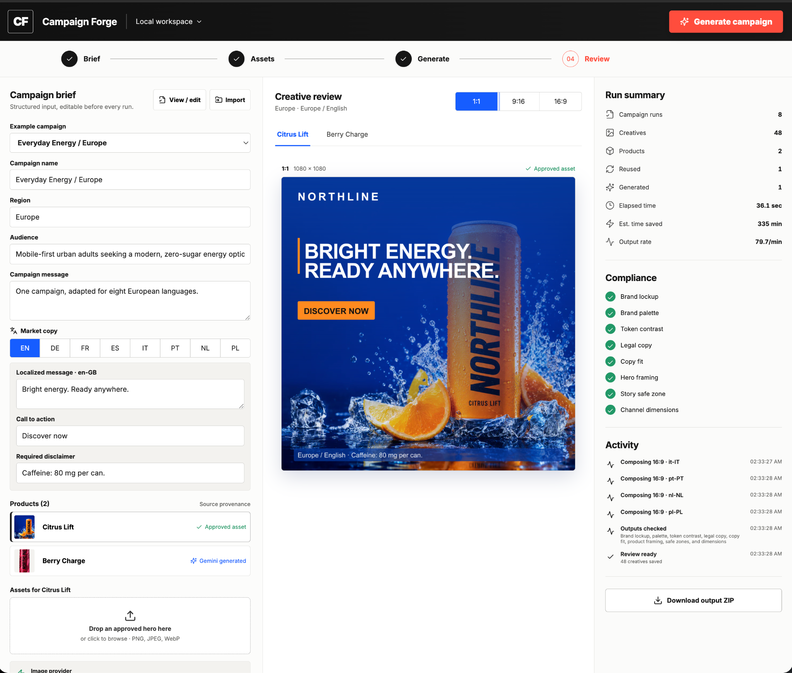

# Campaign Forge

Campaign Forge turns a structured campaign brief and product assets into localized social creatives. It runs locally as a React application or from the command line, records where each hero image came from, and exports exact channel sizes with a machine-readable report.



*Completed live workflow: eight editable languages, an approved asset plus a Gemini-generated hero, three channel formats, measured run efficiency, compliance evidence, activity history, and ZIP delivery.*

## Demo video

A three-minute walkthrough: local setup and sample mode, the eight-market brief, the generation boundary that protects approved packaging, one live provider call, the 48-creative result, pre-spend compliance checks, measured run efficiency, and ZIP delivery.

▶ **[Play the demo (2:59, MP4)](https://github.com/JT5D/creative-automation-pipeline-v2/raw/main/docs/video/campaign-forge-demo.mp4)**

## Quick start

Requires Node.js 22.12 or newer.

```bash
git clone https://github.com/JT5D/creative-automation-pipeline-v2.git
cd creative-automation-pipeline-v2
npm install
cp .env.example .env
npm run dev
```

Open `http://127.0.0.1:5173`, review the preloaded brief, and select **Generate campaign**. The Express API runs on port 3001. No database, Docker, cloud storage, or API credential is required for sample mode; Windows PowerShell users can replace `cp` with `Copy-Item`.

For live generation, add `GEMINI_API_KEY` to `.env` and leave `IMAGE_PROVIDER=auto`, then restart `npm run dev`. The UI offers every configured provider that passes its boot-time credential probe plus an explicit **Included sample · no API call** option. Secrets stay server-side and `.env` is ignored by Git.

Run `npm run check` before a credentialed live run. At server boot, Campaign Forge makes one no-spend authentication request; **Google Gemini verified** confirms that the credential probe passed. **Gemini generated** and `verification.imageGeneration: "live"` in `report.json` confirm that image generation completed.

The same pipeline can be run without the interface:

```bash
npm run campaign
```

The default sample produces 12 creatives: two products × two locales × three aspect ratios.

Four editable example campaigns are available from the **Example campaign** selector:

- Fresh Energy / Germany — English and German
- Summer Energy / California — English and Spanish
- Active Energy / Canada — English and French
- Everyday Energy / Europe — eight BCP 47 locales and 48 outputs in one run

They share the same two product assets so comparisons can focus on market adaptation rather than setup. Campaign name, region, audience, campaign message, and each locale's message, CTA, and disclaimer are directly editable in the form. **View / edit** exposes the complete validated JSON contract in the app; JSON or YAML can also be imported to change products, brand tokens, prohibited terms, prompts, markets, and ratios.

The approved-hero uploader accepts decoded PNG, JPEG, and WebP images up to 15 MB; it does not trust the filename or browser MIME label alone. Reusable fixtures are provided in `samples/uploads/` for an alpha-channel packshot, an opaque JPEG hero, and an opaque WebP hero. Asset paths are optional in the brief: with a verified provider, a product that has no image input is generated from its name, description, campaign, audience, market, and optional generation prompt.

The included market copy is illustrative, not native-approved. Production localization should use transcreation—adapting intent, tone, idiom, CTA, and legal requirements for each market—followed by native-speaker and legal review.

## Image sources

The pipeline selects one image path per product:

| Product input | Pipeline behavior | Report value |
|---|---|---|
| `approvedHeroPath` | Reuse the supplied hero | `approved` |
| Missing hero with provider credentials | Generate a scene; composite an approved packshot when supplied | `generated-live` |
| Sample mode with `cachedGeneratedHeroPath` | Use the included cached sample and state that no live generation occurred | `generated-sample` |

The sample brief demonstrates both asset reuse and missing-image handling. Citrus Lift reuses approved photography. Berry Charge supplies a transparent packshot; live mode generates only the scene, then Sharp composites the approved packaging so the model cannot alter label details.

### Adobe Firefly

Add the following to `.env`:

```dotenv
IMAGE_PROVIDER=firefly
FIREFLY_SERVICES_CLIENT_ID=...
FIREFLY_SERVICES_CLIENT_SECRET=...
```

The server uses OAuth client credentials and Adobe Firefly's asynchronous Image5 endpoint. It polls the job URL and downloads the successful result from `result.outputs`.

### OpenAI Images fallback

```dotenv
IMAGE_PROVIDER=openai
OPENAI_API_KEY=...
OPENAI_IMAGE_MODEL=gpt-image-2
```

### Google Gemini / Nano Banana Pro

```dotenv
IMAGE_PROVIDER=gemini
GEMINI_API_KEY=...
GEMINI_IMAGE_MODEL=gemini-3-pro-image
```

Gemini uses the Interactions image API and the same scene-only prompt boundary as the other providers; the approved packshot is composited afterward by the pipeline. `IMAGE_PROVIDER=auto` prefers Firefly, then OpenAI, then Gemini when multiple providers are configured. Credentials remain on the server and `.env` is ignored by Git.

## Campaign brief

JSON and YAML are accepted. The schema requires at least two products and all three assignment ratios.

```yaml
schemaVersion: "1.0"
id: northline-fresh-energy-de
name: Fresh Energy / Germany
region: Germany
audience: Urban professionals 25-40
message: Bright energy. Zero compromise.
manualMinutesPerCreative: 5

brand:
  name: NORTHLINE
  primaryColor: "#073A9D"
  secondaryColor: "#FF8A1E"
  prohibitedWords: [cure, miracle, guaranteed]

products:
  - id: citrus-lift
    name: Citrus Lift
    description: Sparkling citrus energy
    approvedHeroPath: samples/assets/citrus-lift-approved-hero.webp
  - id: berry-charge
    name: Berry Charge
    description: Sparkling berry energy
    referenceAssetPath: samples/assets/berry-charge-packshot.webp
    cachedGeneratedHeroPath: samples/assets/berry-charge-generated-sample.webp

markets:
  - locale: en-DE
    label: Germany / English
    message: Bright energy. Zero compromise.
    callToAction: Discover now

ratios: [1x1, 9x16, 16x9]
```

See [`samples/campaign.yaml`](samples/campaign.yaml) for the complete bilingual example.

### Input contract

There is no single universal campaign-brief standard. This implementation uses a strict, versioned contract aligned with current interoperable web standards:

- BCP 47 language tags are validated and locale/product identifiers must be unique.
- `/api/schema` exposes a JSON Schema Draft 2020-12 representation for integrations and form generation.
- Unknown fields are rejected so misspelled settings cannot silently disappear.
- Zod is the runtime source of truth shared by UI, API, and CLI.

## Output

Every run has its own timestamped directory:

```text
outputs/<campaign>/<run-id>/
  report.json
  <product>/
    source/<approved-or-generated-hero>
    1x1/<locale>.png
    9x16/<locale>.png
    16x9/<locale>.png
```

The browser can download the same directory as a ZIP. `report.json` contains image provenance, provider/model/prompt data for live calls, output dimensions, compliance results, event history, elapsed time, and estimated time saved. The UI also counts completed campaign runs from the local output workspace.

The time-saved number is an estimate, not a measured KPI. It uses `manualMinutesPerCreative` from the brief (5 minutes in the sample) minus pipeline runtime, so the assumption is visible and easy to replace with a measured baseline.

## Checks

Before any image provider is called, the server validates the brief, scans configured prohibited terms, verifies brand text-token contrast, and confirms that message, CTA, and disclaimer text fit every template. Each output is then checked for:

- rendered brand name and configured colors
- WCAG 2.2 AA 4.5:1 contrast for the white/primary and dark/secondary text-token pairs
- required 1:1, 9:16, and 16:9 dimensions
- legal preflight status
- copy fit
- 9:16 story safe zones

Run the full local gate with:

```bash
npm run check
```

This runs both TypeScript configurations, the Vitest suite, and the production build. Tests cover the 12-output run, exact dimensions and output organization, legal/copy-fit/contrast failures before provider spend, approved-packshot preservation, provider authentication and generation contracts, strict brief and BCP 47 validation, uploads, API execution, and ZIP download.

## Assignment and bonus coverage

| Evaluation item | Evidence in the MVP |
|---|---|
| JSON/YAML brief with 2+ products, region, audience, and message | Strict import, complete in-app brief editor, field form, and four ready-to-run examples |
| Reuse supplied assets; use GenAI when a hero is missing | Approved-asset path plus Firefly/OpenAI/Gemini scene generation and deterministic approved-packshot composition |
| 1:1, 9:16, and 16:9 outputs | Exact dimensions verified for every output |
| English minimum | Every example includes English |
| Local CLI/application | React UI and CLI call the same pipeline |
| Organized delivery | Timestamped product/ratio/locale folders, report, and ZIP |
| Run/design/assumption/limit documentation | This README documents setup, inputs, outputs, design decisions, assumptions, and limitations |
| **Bonus: localization** | Eight-language European preset; localized message, CTA, and disclaimer editing |
| **Bonus: brand compliance** | Deterministic lockup/palette, hero framing, safe zones, copy fit, and token contrast evidence |
| **Bonus: legal checks** | Configurable prohibited-term gate runs before provider spend |
| **Bonus: reporting** | Provenance, provider/model/prompt, checks, events, runtime, throughput, and time-saved estimate |

## Business goals and evidence

| Goal or pain point | What the MVP demonstrates |
|---|---|
| Accelerate campaign velocity / manual overload | One brief creates every product × locale × channel variation in one run. CLI and web paths share the same implementation. |
| Ensure brand consistency / inconsistent quality | Deterministic templates apply the configured palette, brand name, copy hierarchy, CTA, disclaimer, dimensions, and story safe zones. |
| Maximize local relevance | Copy, CTA, and disclaimers vary by BCP 47 locale while approved product imagery remains consistent. Examples are editable and require native transcreation/legal approval for production. |
| Reduce approval friction | Legal, contrast, and copy-fit issues stop before generation. The review screen, event history, provenance, and ZIP report keep evidence with the assets. |
| Optimize ROI, time, and spend efficiency | The report measures elapsed time and output rate; estimated time saved uses a visible brief assumption. One provider call creates the missing product scene, while every locale/ratio is derived deterministically at no additional generation call. Approved asset reuse removes that call entirely. |
| Gain actionable insights | The workspace counts completed campaigns; each report records outputs, source mix, checks, and timing for later aggregation with channel results. |

### Success metrics

| Metric | Calculation |
|---|---|
| Campaign runs | Count of completed `report.json` files in the local output workspace |
| Creatives generated | Products × locales × ratios for the current run |
| Estimated time saved | `(creatives × manualMinutesPerCreative) − pipeline runtime` |
| Output rate | `creatives ÷ elapsed minutes` for the current run |
| Asset reuse | Number of products using an approved hero rather than generation |
| Live generation calls | `generatedLive` products; one call per missing product, independent of locale/ratio count |

Currency spend, CTR, and conversion data are intentionally not invented. Provider pricing is external and can change; production would record provider billing metadata, attach delivery IDs to each creative, ingest channel performance, and compare cost and results by market, source, message, and format.

The most defensible headline metrics are campaign runs completed, creatives delivered, elapsed time/output rate, estimated production time saved, and asset reuse. The MVP does not invent performance lift before channel data exists.

## Glossary

| Term | Meaning |
|---|---|
| API | Application Programming Interface—the server boundary used by the UI, CLI, and image providers |
| BCP 47 | The standard format for language-and-region identifiers such as `fr-FR` or `en-GB` |
| CLI | Command-Line Interface; the non-browser way to run the same pipeline |
| CTA | Call to action—the short instruction on an ad, such as “Discover” |
| CTR | Click-through rate—the percentage of impressions that produce a click |
| C2PA | Coalition for Content Provenance and Authenticity; the standard behind signed Content Credentials |
| GenAI | Generative AI; used here only to create a missing product scene |
| JSON / YAML | Structured text formats accepted for campaign briefs |
| KPI | Key performance indicator, such as output rate or approval-cycle time |
| MVP | Minimum viable product—the smallest working implementation that proves the workflow |
| ROI | Return on investment; business results relative to time and spend |
| WCAG | Web Content Accessibility Guidelines; the source of the configured contrast threshold |

## Design notes and limits

- React and Express provide one local review workflow; the CLI calls the same pipeline.
- Sharp uses non-cropping hero zones for every ratio, then handles deterministic overlays, localization, packshot composition, and PNG output. The report records the source and rendered bounds for each framing check.
- Local storage keeps setup small. A production service would use object storage, queued/idempotent jobs, authentication, approval state, and persisted run history.
- The prohibited-term scanner is a preflight aid, not legal approval.
- The contrast check covers configured text-token pairs, not a pixel-level accessibility certification of arbitrary photography.
- Provenance is stored in `report.json`; production-grade cryptographic Content Credentials/C2PA signing would require a trusted signer and preservation through final composition.
- Provider adapters are contract-tested with mocked HTTP responses. A verified status proves authentication; a successful credentialed run and its `report.json` prove image generation.
